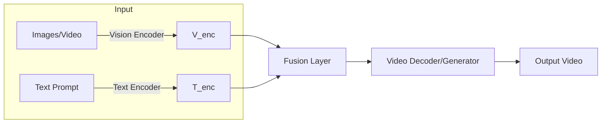

# CVMultimodal: Vision and Language Fusion Framework

[](#) [](#) [](#)

## Executive Summary
CVMuiltimodal is a **multi-modal AI framework** that integrates vision (images/video) and language (text) to perform tasks like video generation, classification, and understanding. It encodes each input modality with specialized networks and projects them into a unified embedding space【24†L99-L107】. This unified representation enables cross-modal reasoning (e.g. understanding how an image and a caption relate to the same concept【24†L115-L120】). The core model (often a transformer-based backbone) then processes all modalities together to produce outputs (such as a synthesized video or classification results). In practice, CVMultimodal can generate example videos (see `result.mp4` in this repo) by fusing static images and text prompts into a coherent video sequence. This README provides a comprehensive guide for researchers and developers to install, configure, train, and use CVMultimodal, including troubleshooting tips and examples.

## Features
- **Multi-modal Fusion:** Supports images, video, and text inputs; fuses them for tasks like text-image-to-video generation and video understanding.
- **Modular Architecture:** Uses vision encoders (e.g. Vision Transformers) and language encoders that project into a shared space【26†L133-L140】【26†L147-L156】.
- **Extensible Backbones:** Core model is a transformer-based LLM that processes all tokens (image patches, text tokens) jointly【26†L158-L166】.
- **Pre-built Tasks:** Includes scripts for training, evaluation, and demo generation on standard datasets.
- **Demo Video:** A sample output (`result.mp4`) is provided, illustrating the model’s capabilities.
- **Configuration Driven:** Customizable via YAML/JSON config files (model settings, data paths, etc.).
- **Cross-Platform:** Runs on Linux, Windows, or macOS; GPU support for acceleration.
- **Easy Installation:** Install via `pip`, `conda`, or Docker.

## Architecture Overview
CVMultiModal’s pipeline follows a typical modern multimodal design. Each input modality is first encoded by a **modality-specific encoder** (e.g. a Vision Transformer for images, a text Transformer for language)【26†L133-L140】. These encoders convert raw data into fixed-size embedding vectors. A **projection layer** (often a linear or small network) then aligns these embeddings into a shared representation space【26†L147-L156】. Finally, a unified Transformer (the “backbone” LLM) takes all embeddings as tokens and processes them jointly to produce the output【26†L158-L166】. Conceptually, this means the model “sees” an image as a sequence of patch embeddings and text as a sequence of word tokens, and reasons across both simultaneously【24†L99-L107】【26†L158-L166】.

Below is a high-level dataflow diagram (using Mermaid) illustrating the input-output flow. In this example, image and text inputs are encoded, fused, and used to generate an output video:



- *Figure:* Input image/video and text are encoded and fused into a unified representation, then decoded to produce the output video.

## Prerequisites
- **Python 3.8+** (tested on 3.8–3.10).  
- **PyTorch** (>=1.9) with CUDA for GPU acceleration (optional but recommended).  
- **Libraries:** Common ML and vision libraries (as listed in `requirements.txt` or `setup.py`), e.g.: `torchvision`, `transformers`, `opencv-python`, `numpy`, `scipy`, `Pillow`, etc.  
- **Operating System:** Cross-platform (Linux, Windows, macOS). No special OS restrictions.  
- **Hardware:** A modern CPU is sufficient for small examples; a CUDA GPU (e.g. NVIDIA) is recommended for training or large models.  
- **Disk Space:** Depends on datasets; plan for tens of GB if using large vision datasets.  

Verify installation by running something like:
```bash
python -c "import torch; print(torch.__version__)"
```

## Installation
Clone the repository and install dependencies. For example, using `git` and `pip`:
```bash
git clone https://github.com/lystiger/CVMultimodal.git
cd CVMultimodal
pip install -r requirements.txt
```
Or create a Conda environment:
```bash
conda create -n cvmultimodal python=3.8 -y
conda activate cvmultimodal
conda install --file requirements.txt -y
```
Optionally, a `Dockerfile` (if provided) can be used:
```bash
docker build -t cvmultimodal .
```
*Note:* Exact dependency versions are specified in `requirements.txt` (or `setup.py`) in the repo. If unclear, use latest stable releases of PyTorch and common libraries. 

## Configuration
CVMultiModal uses configuration files (e.g. `config.yaml` or `config.json`) to set model hyperparameters, dataset paths, and runtime options. Edit the provided template (e.g. `configs/default.yaml`) to specify:
- **Model parameters:** number of layers, embedding sizes, etc.
- **Training settings:** batch size, learning rate, epochs.
- **Dataset paths:** where to find your images/videos and text files.
- **Output paths:** where to save logs, checkpoints, and results.
  
For example, you might set the `data_root` or `output_dir` fields:
```yaml
data:
  images_dir: "./data/images"
  texts_file: "./data/captions.txt"
output:
  results_dir: "./outputs"
```
Ensure paths are correct. By default, configs may assume a directory structure. Always check and adjust paths in the config before running scripts.

## Dataset Preparation
Prepare your data according to the expected structure. For example:
- Place images or video frames in a directory (e.g. `data/images/`).
- Place accompanying text prompts/captions in a text file (e.g. `data/texts.txt`), one per line or a structured format.
- If using video input, ensure videos are in a format supported by OpenCV.
- (Optional) Use any provided scripts to convert raw data into the needed format. For example, a `data_prep.py` script might be available:
  ```bash
  python data_prep.py --input data/raw --output data/processed
  ```
Check if the repo includes any `download` or `prepare_data.sh` scripts for common datasets. Otherwise, follow standard dataset guidelines (e.g., COCO, YouTube8M, etc.) and adjust config paths accordingly.

## Training
Train the model with a training script (e.g. `train.py`). This typically looks like:
```bash
python train.py --config configs/train.yaml
```
You may specify command-line overrides, e.g.:
```bash
python train.py --config configs/train.yaml --epochs 50 --batch_size 16
```
During training, logs and checkpoints are saved to the output directory (as set in config). Monitor training via the console or tools like TensorBoard if enabled. 

Expected outputs:
- Checkpoints (e.g. `model_epoch10.ckpt`) in the output folder.
- Training logs and metrics (accuracy, loss curves).
  
Sample training command:
```
python train.py --config configs/default_train.yaml --epochs 100 --gpu 0
```
Use `--help` or see script docstring for all options.

## Evaluation
Evaluate a trained model on a validation/test set. Typically:
```bash
python evaluate.py --config configs/eval.yaml --checkpoint path/to/model.ckpt
```
This script computes metrics (e.g., accuracy, FID, BLEU, etc. depending on task). The results will be printed and/or saved. Adjust `configs/eval.yaml` to point to your test data and metrics to compute.

Example:
```
python evaluate.py --checkpoint outputs/model_final.ckpt --data test_data/
```
Expected outputs might include a summary of metrics, and possibly result files (e.g. predicted videos or classifications) in the `results_dir`.

## Inference / Usage
Use the inference script to generate outputs from new inputs. For example:
```bash
python inference.py --config configs/infer.yaml \
                   --image data/images/example.jpg \
                   --text "A cat playing the piano" \
                   --output out/result.mp4
```
For video input:
```bash
python inference.py --video data/video/clip.mp4 --text "action description"
```
This will save a result file (e.g. `result.mp4`) demonstrating the model’s output. You can open/play the video to view it:
```bash
# Using a media player
open out/result.mp4   # macOS
xdg-open out/result.mp4  # Linux
# Or using ffmpeg/ffplay
ffplay out/result.mp4
```
Adjust input arguments as needed. The script may also print progress or save intermediate frames.

### Demo Example
A quick example to reproduce the provided demo (`result.mp4`):
```bash
# Generate the demo video using a sample model and inputs
python demo.py --output result.mp4
# or, if demo.py is not available, use inference with sample inputs:
python inference.py --image examples/input1.jpg --text "Sample prompt" --output result.mp4
```
After running, view the video:
```
ffplay result.mp4
```
*(The `result.mp4` file included in the repo shows a sample output.)*

## Scripts and Commands Reference
| Script / Command              | Description                                                   |
|-------------------------------|---------------------------------------------------------------|
| `train.py`                    | Train the CVMultimodal model with specified config.           |
| `evaluate.py`                 | Evaluate model performance on a dataset (output metrics).     |
| `inference.py`                | Run inference (generate output) given input image/video/text.  |
| `demo.py` (or `run_demo.sh`)  | Convenience script to reproduce the demo (`result.mp4`).      |
| `data_prep.py`                | (Optional) Prepare or preprocess dataset files.               |
| `requirements.txt` / `setup.py` | Lists dependencies and installation setup.                |

## Expected Outputs
- **Training:** Model checkpoints (`.ckpt` files), logs, and training metrics (loss, accuracy over epochs).  
- **Evaluation:** Printed/recorded metrics (accuracy, BLEU, FID, etc.) and/or saved evaluation report.  
- **Inference:** Generated output files (e.g. `result.mp4`), which may include videos, images, or text, depending on the task.  
- **Logs:** Any debug or info messages are printed to console or saved to log files (see `logs/` directory if configured).  
Check the `output/` directory (or configured results path) for these files.

## Troubleshooting
- **Installation errors:** If you see `ModuleNotFoundError`, install missing packages via `pip install -r requirements.txt`.  
- **CUDA/Memory issues:** “CUDA out of memory” – try reducing batch size or model size, or run on CPU by setting `--device cpu`.  
- **Config/file not found:** Ensure all file paths (data, checkpoints) in the config are correct relative to your current directory.  
- **Incorrect video playback:** Use `ffplay` or VLC; some MP4 files may not open in all players.  
- **Version conflicts:** If errors occur in PyTorch or libraries, ensure versions meet the prerequisites.  
- **Model output is empty/poor:** Check data formatting and model checkpoints. Try a simple input first.  
- **Permission issues:** On Windows, run console as Administrator if writing to protected directories.  
- **Docker issues:** If using Docker, ensure NVIDIA runtime is enabled (for GPU) and volume mounts correct.

## License
CVMuItimodal is released under the **MIT License** (see `LICENSE` file). You are free to use, modify, and distribute this software under the terms of that license.

**Architecture References:** Vision Transformers divide images into patches【26†L133-L140】. Projection layers align different modality embeddings【26†L147-L156】. A unified Transformer processes all modalities like text tokens【26†L158-L166】. These design principles are consistent with multimodal model research【24†L99-L107】【24†L115-L120】. 

